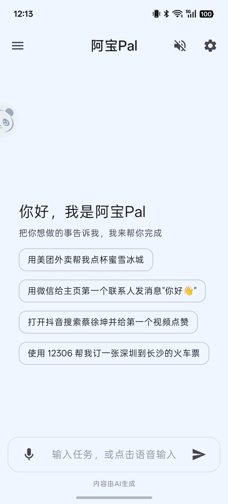
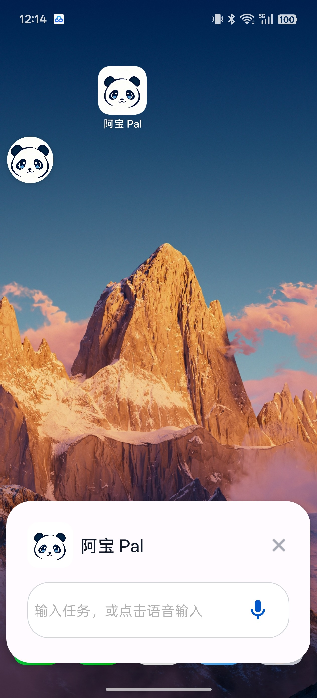
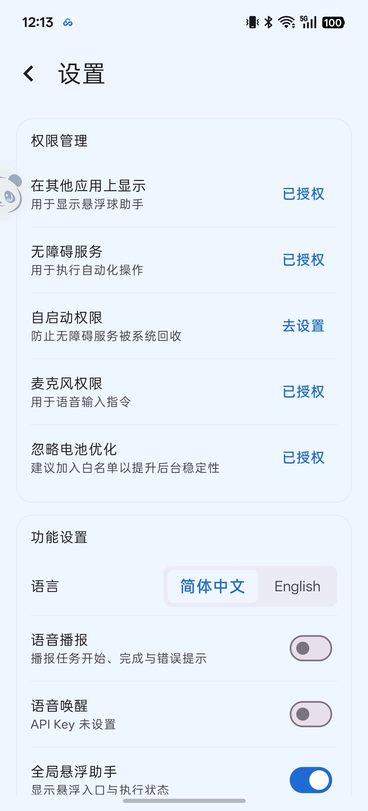
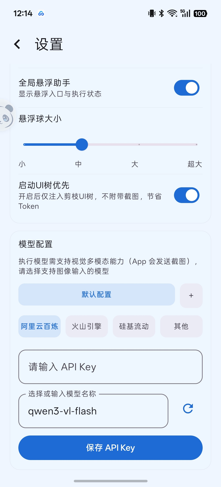
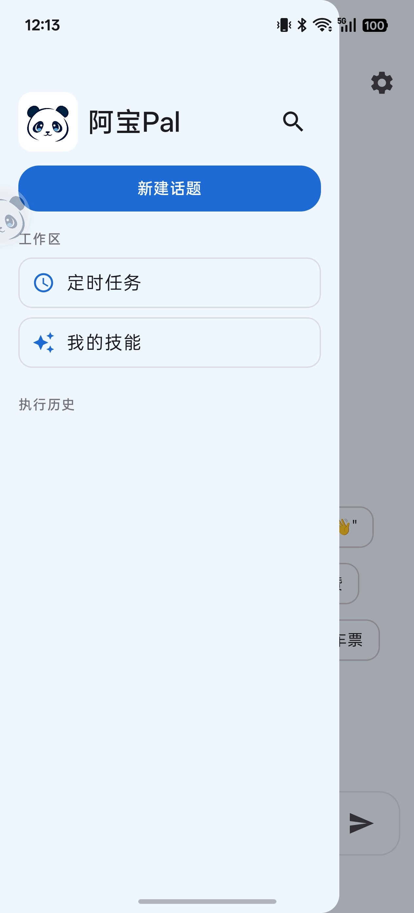

<p align="center">
  
</p>

<h1 align="center">AbaoPal · 阿宝PAl</h1>

<p align="center">
  <strong>把一句话，变成手机上的一连串真实动作。</strong>
</p>

<p align="center">
  原生 Android · 多 Agent 协作 · 屏幕理解 · 跨应用自动化
</p>

<p align="center">
  
  
  
  
  <a href="LICENSE"></a>
</p>

<p align="center">
  <a href="#highlights">亮点</a> ·
  <a href="#demo">演示</a> ·
  <a href="#how-it-works">工作原理</a> ·
  <a href="#quick-start">快速开始</a> ·
  <a href="#api-key">API Key</a> ·
  <a href="#security">安全边界</a>
</p>

---

阿宝PAl是一款运行在 Android 端的开源手机自动化 Agent。你描述目标，它读取当前界面、规划步骤、执行点击与输入，再根据屏幕反馈继续行动。

他并非一段只能照本宣科的固定脚本：自然语言、实时界面、可复用 Skills、操作录制与语音入口，被放进了同一个执行循环里。你可以从一个简单任务开始，也可以逐步把自己的操作经验沉淀成可编辑、可回放的手机能力。


<a id="demo"></a>

## 🎬 演示与预览

### 界面预览

<table>
  <tr>
    <td colspan="2" width="33%" align="center">
      <br>
      <sub>首页与快捷任务</sub>
    </td>
    <td colspan="2" width="33%" align="center">
      <br>
      <sub>全局悬浮助手</sub>
    </td>
    <td colspan="2" width="33%" align="center">
      <br>
      <sub>权限与功能设置</sub>
    </td>
  </tr>
  <tr>
    <td colspan="3" width="50%" align="center">
      <br>
      <sub>多模型配置</sub>
    </td>
    <td colspan="3" width="50%" align="center">
      <br>
      <sub>任务与技能入口</sub>
    </td>
  </tr>
</table>

### 示例视频

<p align="center">
  <a href="docs/videos/abaopal-demo-2x.mp4">
    
  </a>
</p>

<p align="center">
  <a href="docs/videos/abaopal-demo-2x.mp4"><strong>▶ 点击观看演示</strong></a><br>

</p>

<a id="highlights"></a>

## ✨ 亮点功能

<table>
  <tr>
    <td width="33%" valign="top"><strong>🗣️ 一句话驱动</strong><br>用自然语言描述目标，由 Agent 拆解并尝试完成多步手机操作。</td>
    <td width="33%" valign="top"><strong>👀 双通道界面感知</strong><br>结合无障碍 UI 树与屏幕截图，让文本模型与视觉模型各展所长。</td>
    <td width="33%" valign="top"><strong>🧠 多 Agent 协作</strong><br>规划、执行、动作落地与结果判断分工协作，形成持续反馈循环。</td>
  </tr>
  <tr>
    <td width="33%" valign="top"><strong>⏺️ 录制、编辑、回放</strong><br>把点击、滑动、输入和时间间隔录制成可编辑指令集，重复任务不必从头教。</td>
    <td width="33%" valign="top"><strong>🧩 可扩展 Skills</strong><br>通过 YAML 与用户自定义技能沉淀应用知识，并用向量检索匹配任务上下文。</td>
    <td width="33%" valign="top"><strong>🎙️ 语音与定时入口</strong><br>支持语音输入、语音唤醒、播报、声纹校验和定时任务，让触发方式更自然。</td>
  </tr>
</table>

### 你可以从这些场景开始

- 打开系统设置并找到指定功能入口
- 在内容应用中完成搜索、浏览和信息整理
- 录制一段重复操作，调整步骤与间隔后再次回放
- 为常用应用编写自己的 Skill 或指令集
- 通过悬浮助手观察任务进度，并在需要时立即停止

> 自动化成功率会受到模型能力、应用版本、页面结构、系统 ROM、权限状态和网络质量影响。涉及支付、密码、验证码、身份信息或不可逆操作时，请始终人工接管。

<a id="how-it-works"></a>

## 🧭 它如何工作

| 主要能力 | 采用的方案 | 依赖或权限 |
| --- | --- | --- |
| 自然语言多步任务 | `TaskManager`、`Planner`、`Executor`、`Director` 与事件总线协作 | 第三方 LLM API、网络 |
| 界面理解 | `AccessibilityNodeInfo` 裁剪 UI 树；Android 11+ 使用无障碍截图补充视觉上下文 | 无障碍服务、截图内容可能发给模型 |
| 点击与跨应用操作 | `dispatchGesture`、无障碍节点动作、系统全局动作与 Android Intent | 无障碍服务、应用查询 |
| 操作录制与回放 | 悬浮层采集点击/滑动/输入，记录归一化坐标与时间轴；Room 保存指令集 | 悬浮窗、无障碍服务 |
| Skills 与检索 | Jackson 解析 YAML；Room 保存用户技能；百炼 Embedding + 本地向量存储检索 | 百炼 API、网络 |
| 语音交互 | DashScope Paraformer ASR；阿里云 TTS，并以系统 TTS 作为本地回退；本地 sherpa-onnx 关键词检测与 3D-Speaker 声纹特征 | 麦克风；云端 ASR/TTS 需要网络 |
| 定时执行 | `AlarmManager`、广播接收器与 Agent 运行时联动 | 精确定时权限视系统版本而定 |
| 风险拦截 | 对部分包名及支付、密码等关键词执行有限规则拦截 | 仅是辅助护栏，不构成完整安全保障 |

### 关于语音识别相关功能

由于技术所限，语音识别和语音输入功能需要阿里云DashScope paraformer-realtime功能，如果配置的不是百炼平台的API Key，这些功能可能无法正常使用。


<a id="quick-start"></a>

## 🚀 快速开始

### 1. 准备环境

| 项目 | 要求 |
| --- | --- |
| 开发环境 | Android Studio，或可用的 Android SDK 命令行环境 |
| 构建 JDK | JDK 17 |
| Android SDK | Platform 36、Build Tools 36.0.0 |
| 设备 | Android 8.0 / API 26+，仅 `arm64-v8a` |
| 推荐体验 | Android 11 / API 30+，以使用当前截图链路 |

仓库包含 Gradle Wrapper、sherpa-onnx AAR 和运行时 ONNX 模型；首次构建仍可能从网络下载 AndroidX、Kotlin、Compose 等 Gradle 依赖。

### 2. 配置本机 Android SDK

克隆或下载仓库后，在项目根目录复制示例配置：

```powershell
# Windows PowerShell
Copy-Item local.properties.example local.properties
```

```bash
# macOS / Linux
cp local.properties.example local.properties
```

编辑 `local.properties`，把 `sdk.dir` 改为本机 Android SDK 的绝对路径。不要把该文件、真实 API Key 或签名口令提交到 Git。

### 3. 编译与检查

```powershell
# Windows
.\gradlew.bat --no-daemon :app:testDebugUnitTest :app:lintDebug :app:assembleDebug
```

```bash
# macOS / Linux
./gradlew --no-daemon :app:testDebugUnitTest :app:lintDebug :app:assembleDebug
```

Debug APK 生成于：

```text
app/build/outputs/apk/debug/app-debug.apk
```

连接设备并启用 USB 调试后，可使用 ADB 安装：

```bash
adb install -r app/build/outputs/apk/debug/app-debug.apk
```

### 4. 首次配置与使用

1. 启动 App，按引导开启无障碍服务、悬浮窗和麦克风权限。
2. 进入「设置 → 模型配置」，先在默认配置中选择「阿里云百炼」，保存百炼 API Key。
3. 如果要使用火山方舟或硅基流动作为执行模型，请点击「新建配置」创建独立模型档案，填写对应平台 Key，并选择支持图像输入的模型。
4. 激活执行模型档案，但保留之前保存的百炼 Key；当前版本的规划、Embedding 和语音基础能力仍会使用它。
5. 返回对话页输入一个低风险任务，或从悬浮助手、快捷指令、指令集和定时任务开始。


<a id="api-key"></a>

## 🔑 获取与配置 API Key

### 最低配置

| Key | 是否必需 | 当前用途 |
| --- | --- | --- |
| 阿里云百炼 / DashScope Key | 完整 Agent 流程必需 | Embedding、部分规划、ASR，以及可选的阿里云 TTS |
| 火山方舟 Key | 可选 | 选择火山方舟视觉模型作为执行模型时使用 |
| 硅基流动 Key | 可选 | 选择硅基流动视觉模型作为执行模型时使用 |
| 其他 OpenAI-compatible Key | 可选 | 自定义执行模型服务时使用 |

执行模型会接收截图，因此必须支持图像/视觉输入。平台展示的模型、权限、额度、地域和价格可能变化，请以账号控制台与最新官方文档为准。

<details>
<summary><strong>阿里云百炼 / DashScope</strong>（当前基础能力必需）</summary>

1. 登录[阿里云百炼控制台](https://bailian.console.aliyun.com/)，选择准备使用的地域。
2. 进入「API Key」，点击「创建 API Key」，选择业务空间和权限范围。
3. 创建后立即保存完整 API Key 与 API Host；新密钥的明文可能只显示一次。
4. 在 App 默认模型配置中选择「阿里云百炼」，粘贴 Key 并保存。

当前代码内置的百炼 OpenAI-compatible 地址为：

```text
https://dashscope.aliyuncs.com/compatible-mode/v1
```

百炼 Key 与 API Host 具有地域和业务空间边界。如果控制台显示的 API Host 与内置地址不同，请以控制台为准；当前固定基础设施地址可能需要相应代码适配。

- [官方：获取 API Key](https://help.aliyun.com/zh/model-studio/get-api-key)
- [官方：OpenAI-compatible Chat](https://help.aliyun.com/zh/model-studio/qwen-api-via-openai-chat-completions)
- [官方：Base URL 总览](https://help.aliyun.com/zh/model-studio/base-url)

</details>

<details>
<summary><strong>火山方舟</strong>（可选执行模型）</summary>

1. 登录[火山方舟控制台](https://console.volcengine.com/ark/region:ark+cn-beijing/apikey)，按控制台提示开通所需模型服务。
2. 进入「API Key 管理」，创建并复制 API Key。
3. 复制账号中可用、且支持图像输入的模型 ID。
4. 在 App 中新建模型配置档案，选择「火山引擎」，填写 Key 与模型 ID 后保存。

项目内置的北京地域 Base URL：

```text
https://ark.cn-beijing.volces.com/api/v3
```

普通模型 API 与 Coding Plan 使用不同地址；本项目调用常规模型接口，请不要误填 `/api/coding`。

- [官方：获取 API Key 并配置](https://www.volcengine.com/docs/82379/1541594)
- [官方：API 文档中心](https://api.volcengine.com/api-docs/view/overview?serviceCode=ark)

</details>

<details>
<summary><strong>硅基流动 SiliconFlow</strong>（可选执行模型）</summary>

1. 注册并登录 SiliconFlow，进入[API 密钥管理](https://cloud.siliconflow.cn/account/ak)。
2. 创建并复制新的 API Key。
3. 从[模型广场](https://cloud.siliconflow.cn/models)复制支持图像输入的完整模型 ID。
4. 在 App 中新建模型配置档案，选择「硅基流动」，填写 Key 与模型 ID 后保存。

项目内置的 OpenAI-compatible Base URL：

```text
https://api.siliconflow.cn/v1
```

- [官方：Quickstart](https://docs.siliconflow.cn/cn/userguide/quickstart)
- [官方：Chat Completions API](https://docs.siliconflow.cn/cn/api-reference/chat-completions/chat-completions)

</details>

<details>
<summary><strong>其他 OpenAI-compatible 服务</strong></summary>

在「其他」配置中填写 Base URL、API Key 与模型名。当前客户端使用 Bearer 鉴权，并调用：

- `POST /chat/completions`
- `GET /models`
- 基础设施能力还会使用 `POST /embeddings`

自定义执行模型至少需要兼容项目当前的 Chat Completions 请求格式，并能处理 `image_url` 类型的多模态输入。“OpenAI-compatible”不代表所有实现、字段和模型都能无差别工作。

</details>

<a id="security"></a>

## 🔐 权限、隐私与密钥安全

### 为什么需要这些权限

| 权限或能力 | 用途 | 建议 |
| --- | --- | --- |
| 无障碍服务 | 读取 UI 结构、执行点击/滑动/输入和系统动作 | 使用后可在系统设置中关闭 |
| 悬浮窗 | 展示任务面板、执行进度、录制与停止入口 | 仅在需要时授权 |
| 麦克风 | 语音输入、语音唤醒与声纹校验 | 不使用语音时可拒绝或关闭 |
| 应用列表查询 | 发现并启动目标应用 | 发布到应用商店前复核平台政策 |
| 精确定时与开机广播 | 定时任务和重启后的任务恢复 | 不使用定时任务时可关闭 |


## 🧱 技术栈

- **语言与 UI**：Kotlin 2.0、Jetpack Compose、Material 3
- **架构与异步**：ViewModel、StateFlow、Kotlin Coroutines
- **网络**：Retrofit、OkHttp、Gson，OpenAI-compatible Chat Completions
- **本地数据**：Room、Preferences DataStore、自定义 SQLite 向量存储
- **Skills**：Jackson YAML、内置应用技能、用户自定义技能
- **端侧模型**：sherpa-onnx、WenetSpeech KWS、3D-Speaker ERes2Net
- **云端语音**：DashScope Paraformer ASR、阿里云 TTS；Android 系统 TTS 作为本地回退

## 🗂️ 项目结构

```text
app/src/main/
├── java/.../core/agent/       # Agent 规划、编排与运行时
├── java/.../core/action/      # 动作解析、Handler 与执行
├── java/.../core/llm/         # OpenAI-compatible 模型客户端
├── java/.../core/skill/       # Skills 加载、注册与检索
├── java/.../core/voice/       # 语音唤醒与声纹
├── java/.../recording/        # 操作录制、编辑与回放
├── java/.../service/          # Android 无障碍服务
├── java/.../ui_v2/            # Compose UI 与导航
├── assets/skills/             # 内置 YAML Skills
└── assets/licenses/           # 随 APK 分发的许可材料
```

## ⚠️ 当前限制

- 仅构建 `arm64-v8a`；不支持 x86 模拟器及 32 位设备。
- Android 8.0+ 可以安装，但当前截图主链路建议 Android 11+。
- 完整 Agent 流程仍依赖百炼基础 Key；火山或硅基流动目前是可选执行模型。
- 关键词检测和声纹在本地运行，但 LLM、Embedding、ASR 与云端 TTS 并非离线能力。
- 应用更新、页面改版、WebView/游戏界面、ROM 差异与模型输出都可能造成动作失败。
- 安全拦截是有限规则集，不应在支付、密码、验证码或不可逆流程中无人值守运行。

## 🤝 参与贡献

欢迎通过 Issue 分享复现步骤、机型与系统版本，也欢迎提交小而清晰的 Pull Request：

1. 从最新代码创建分支。
2. 保持改动聚焦，不提交 API Key、本地配置、签名文件或构建产物。
3. 至少运行单元测试、Lint 与 Debug 构建。
4. 涉及权限、网络、数据流或第三方 SDK 时，同步更新隐私与安全说明。

如果这个项目让你看见了手机 Agent 的更多可能，欢迎给它一个 Star，也欢迎一起把“能跑”打磨成“可靠、透明、可扩展”。

## 📄 许可证与第三方材料

项目自有代码和文档以 [MIT License](LICENSE) 发布：

```text
Copyright (c) 2026 伴业科技
```

仓库内第三方 AAR、ONNX 模型及其依赖仍适用各自许可证。来源、版本、SHA-256 与许可材料见 [THIRD_PARTY_NOTICES.md](THIRD_PARTY_NOTICES.md)。

“AbaoPal”“阿宝PAl”、项目图标及第三方名称、产品名和商标分别归其权利人所有。MIT License 不授予商标权。
